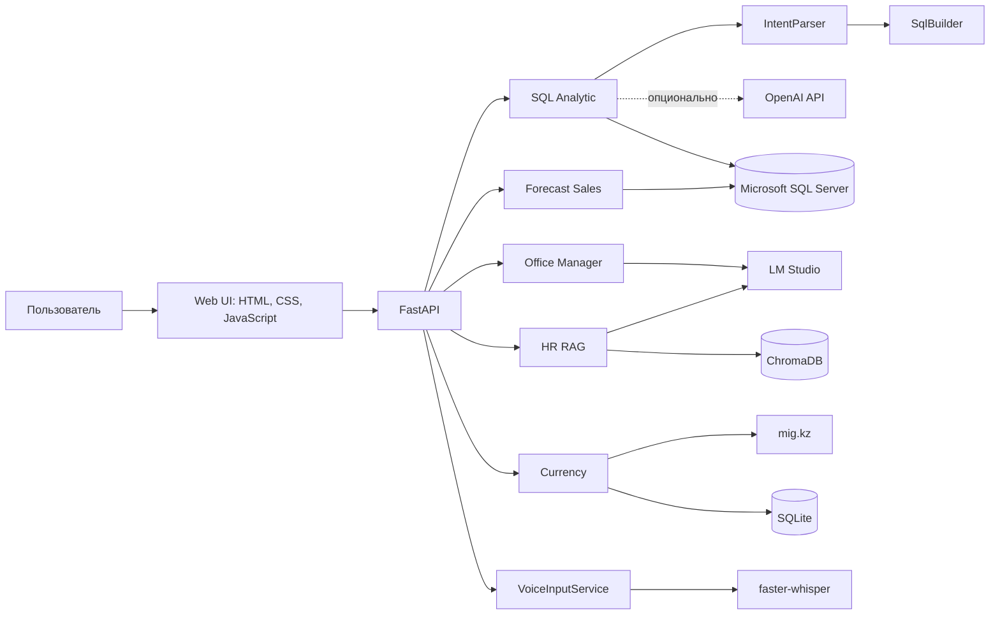

# Viled ATLAS LLM Project

## Полное описание проекта для презентации в NotebookLM

Версия документа: 4 августа 2026 года.

Этот документ описывает фактически реализованную версию Viled ATLAS LLM Project: назначение, архитектуру, агентов, режимы работы, голосовой ввод, источники данных, таблицы и представления, локальные хранилища, набор инструментов, ограничения безопасности и сценарии демонстрации.

---

## 1. Кратко о проекте

Viled ATLAS LLM Project — локальное веб-приложение с командой специализированных AI-агентов и аналитических инструментов. Пользователь работает в едином интерфейсе, но каждый раздел имеет собственную роль, доступы и память.

Главная бизнес-функция проекта — перевод вопросов на естественном языке в безопасные read-only SQL-запросы к Microsoft SQL Server. Система понимает русские бизнес-формулировки, выбирает нужный домен данных, строит SQL, выполняет его локально и показывает пользователю SQL, результат и объяснение.

Кроме BI-аналитики, в системе реализованы:

- общий офисный LLM-ассистент;
- HR-агент с RAG-поиском по PDF-документам;
- прогноз продаж на 12 месяцев;
- валютный модуль с загрузкой данных с mig.kz и локальным хранилищем SQLite;
- локальный голосовой ввод на основе faster-whisper;
- встроенная страница документации архитектуры SQL-агента.

Ключевая идея проекта: одна оболочка объединяет агентов и инструменты, но не смешивает их полномочия. Например, Office Manager не имеет SQL-инструментов, а внешний OpenAI API не получает доступ к SQL Server и не видит результаты запросов.

---

## 2. Пользовательские разделы

### 2.1. Агенты

| Раздел | Идентификатор | Назначение | Доступ к SQL Server | Собственная память |
|---|---|---|---|---|
| SQL Analytic / BI Analytics | `bi_analytics` | Продажи, цены, товары, остатки, себестоимость, закупки, подразделения и GM | Да, только read-only запросы | Да |
| Office Manager | `office_manager` | Письма, резюме, планы, документы и общие вопросы | Нет | Да |
| HR | `hr` | Ответы по положениям о премировании и другим загруженным HR PDF | Нет | Да, отдельно чат и векторная база документов |

### 2.2. Инструменты

| Раздел | Идентификатор | Назначение | Память чата |
|---|---|---|---|
| Forecast Sales | `forecast_sales` | Месячная агрегация продаж и прогноз на следующие 12 месяцев | Нет |
| Currency | `currency` | Загрузка курсов с mig.kz, расчет Viled Inform и ведение истории в SQLite | Нет |

### 2.3. Документация

Раздел `SQL Agent Map` (`sql_agent_docs`) — встроенное статическое представление архитектуры и режимов SQL-агента. Это не отдельный backend-агент и не выполняющий код инструмент.

---

## 3. Общая архитектура

Основные программные слои:

1. `web/static/index.html`, `styles.css`, `app.js` — пользовательский интерфейс, переключение агентов, запись аудио и отображение потоковых SQL-ответов.
2. `sql_agent/web.py` — FastAPI API, маршрутизация по рабочим областям, потоковые события, загрузка PDF и голосовая транскрипция.
3. `sql_agent/service.py` — оркестрация SQL-запроса, работа с памятью, уточнения, исполнение и обработка ошибок.
4. `sql_agent/intent_parser.py` — разбор намерения: домен, метрика, фильтры, даты, группировка, сортировка и лимит.
5. `sql_agent/sql_builder.py` — детерминированное построение SQL по структурированному намерению.
6. `sql_agent/query_utils.py` — проверка read-only SQL, безопасное исполнение, лимиты результата и форматирование.
7. `sql_agent/sql_reviewer.py` — генерация или семантическая проверка SQL через OpenAI API.
8. `sql_agent/database.py` — подключение к SQL Server через SQLAlchemy и драйверы pyodbc или pymssql.
9. Специализированные модули: `voice_input.py`, `hr.py`, `forecast.py`, `currency.py`.

---

## 4. SQL Analytic: основной BI-агент

SQL Analytic принимает обычный вопрос или явный SQL `SELECT` и возвращает:

- сформированный или полученный от пользователя SQL;
- результат запроса в табличном виде;
- краткое объяснение логики;
- в потоковом режиме — отдельные события генерации SQL, выполнения, результата и проверки OpenAI.

### 4.1. Как обрабатывается запрос

1. Загружается локальная память SQL-агента.
2. Если предыдущий ответ был уточняющим вопросом, короткий ответ пользователя объединяется с исходным вопросом.
3. Если пользователь явно вставил один `SELECT`, система проверяет и исполняет его без преобразования в intent.
4. Иначе `IntentParser` сначала применяет детерминированные правила.
5. Для нераспознанного намерения возможен fallback к локальной LLM в LM Studio.
6. Результат локальной LLM считается недоверенным структурированным вводом и повторно валидируется.
7. `SqlBuilder` формирует SQL из проверенного intent.
8. Перед выполнением проверяются read-only характер, единственность выражения и ограниченность результата.
9. SQL выполняется локально в SQL Server.
10. Ответ и вопрос сохраняются в локальную память.

### 4.2. Поддерживаемые операции

- детальные выборки;
- агрегаты `SUM`, `COUNT`, `COUNT DISTINCT`, `AVG`, `MIN`, `MAX` в разрешенных доменах;
- группировки по датам, товарам, брендам, категориям, подразделениям и другим поддерживаемым измерениям;
- рейтинги и Top-N;
- фильтры по датам, диапазонам, идентификаторам, валютам и товарным атрибутам;
- понимание русских названий месяцев и относительных дат;
- объединение fact-таблиц со справочниками по документированным ключам;
- специальные расчеты остатков, текущей себестоимости и Gross Margin;
- обработка явного пользовательского `SELECT` без смысловой перезаписи.

### 4.3. Уточняющие вопросы

Агент не угадывает критически неоднозначную метрику. Например:

- «Какой товар продавался лучше всего?» — нужно уточнить: по количеству или по сумме продаж;
- «Общая себестоимость» — может потребовать выбора между оборотом операций `SUM(cost)` и текущим балансом `cost_sum`;
- неподдерживаемая явно указанная валюта также требует уточнения.

---

## 5. Режимы генерации и проверки SQL

В интерфейсе есть два независимых переключателя.

### 5.1. SQL CALCULATION

Если включен, OpenAI API получает вопрос пользователя и локальную документацию схемы/бизнес-правил и создает read-only SQL. После локальной проверки этот SQL выполняется приложением.

Если выключен, SQL формируется локальным контуром: правила `IntentParser` → при необходимости локальная LLM → детерминированный `SqlBuilder`.

### 5.2. SQL CHECK MODE

Если включен при локальной генерации, OpenAI API семантически проверяет созданный SQL и может показать статус или рекомендуемый вариант. Исполняемым остается исходный локальный SQL; рекомендация не подменяет его автоматически.

Если `SQL CALCULATION` включен, повторная проверка того же SQL пропускается.

### 5.3. Матрица режимов

| SQL CALCULATION | SQL CHECK MODE | Кто создает SQL | Роль OpenAI | Что выполняется |
|---|---|---|---|---|
| ON | ON или OFF | OpenAI API | Генерирует SQL | SQL OpenAI после локальной проверки |
| OFF | ON | Локальный контур | Проверяет смысл SQL | Исходный локальный SQL |
| OFF | OFF | Локальный контур | Не вызывается | Исходный локальный SQL |

Параметры OpenAI в UI:

- модели: `gpt-5.6`, `gpt-5.6-sol`, `gpt-5.6-terra`, `gpt-5.6-luna`;
- reasoning effort: `none`, `low`, `medium`, `high`, `xhigh`, `max`;
- service tier: `default` или `priority` на уровне API-модели запроса.

При недоступном OpenAI режим SQL CALCULATION завершается безопасной ошибкой и не переключается незаметно на другую схему генерации. Полностью локальный SQL-контур доступен при выключенных режимах OpenAI.

### 5.4. Граница передачи данных

OpenAI может получить:

- текст вопроса;
- документацию схемы и бизнес-правил;
- сформированный SQL в режиме проверки.

OpenAI не получает:

- учетные данные SQL Server;
- инструмент прямого подключения к БД;
- строки результата SQL-запроса;
- локальные файлы памяти агентов.

Подключение к SQL Server и исполнение всегда выполняются локальным приложением.

---

## 6. Голосовой ввод

Голосовой ввод реализован локально и доступен из веб-интерфейса через кнопку микрофона.

Поток обработки:

1. Браузер запрашивает разрешение на микрофон.
2. `MediaRecorder` записывает аудио, обычно в WebM.
3. Запись отправляется в `POST /api/voice/transcribe`.
4. Backend проверяет MIME-тип и лимит 15 МБ.
5. `VoiceInputService` передает аудио локальной модели faster-whisper.
6. Распознанный текст возвращается в поле сообщения, после чего пользователь может проверить и отправить его нужному агенту.

Настройки по умолчанию:

| Параметр | Значение по умолчанию | Переменная окружения |
|---|---|---|
| Модель | `small` | `VOICE_MODEL` |
| Устройство | `cpu` | `VOICE_DEVICE` |
| Тип вычислений | `int8` | `VOICE_COMPUTE_TYPE` |
| Язык | русский (`ru`) | `VOICE_LANGUAGE`; значение `auto` включает автоопределение |
| Каталог моделей | `.models/faster-whisper/` | `VOICE_MODEL_DIR` |

Особенности распознавания:

- используется `beam_size=5`;
- включен VAD-фильтр, отсекающий тишину;
- контекст предыдущей транскрипции отключен;
- initial prompt ориентирует модель на запросы к БД и цифровые идентификаторы;
- последовательности из четырех и более произнесенных по отдельности цифр преобразуются в единый номер: «один два три четыре» → `1234`;
- модель загружается лениво при первом запросе;
- параллельные транскрипции сериализуются блокировкой;
- модели являются локальными runtime-данными и не должны попадать в Git.

---

## 7. Office Manager

Office Manager — общий локальный чат-ассистент для повседневных офисных задач:

- подготовка писем;
- резюмирование;
- планы и чек-листы;
- работа с текстовыми документами;
- ответы на общие вопросы.

Он использует локальную LLM через OpenAI-совместимый endpoint LM Studio, по умолчанию `http://127.0.0.1:1234/v1`, модель `llama-3.2-3b-instruct`, temperature `0`.

Office Manager принципиально не имеет SQL-инструментов и отдельный от BI-агента контекст. Его память хранится в `.agent_memory/office_manager_memory.json`.

---

## 8. HR-агент и RAG по PDF

HR-агент отвечает только на основании загруженных HR-документов, прежде всего положений о премировании. Если ответа нет в контексте, агент должен прямо сообщить об этом. По возможности в ответе указываются имя файла и страница.

### 8.1. Загрузка документа

- принимаются только PDF;
- текст сначала извлекается библиотекой pypdf;
- если текстового слоя нет, применяется OCR: PyMuPDF преобразует страницы в изображения, а Tesseract распознает русский и английский текст;
- текст нормализуется и делится на перекрывающиеся фрагменты;
- фрагменты получают метаданные: источник, страница и номер чанка;
- embeddings рассчитываются локальной моделью `text-embedding-nomic-embed-text-v1.5@f32` через LM Studio;
- векторы и тексты сохраняются в постоянной коллекции ChromaDB `hr_bonus_policies`.

### 8.2. Ответ на вопрос

1. Вопрос преобразуется в embedding.
2. Из ChromaDB выбираются пять наиболее релевантных фрагментов.
3. Фрагменты вместе с краткой историей диалога передаются локальной LLM.
4. LLM формирует ответ только из найденного контекста.

### 8.3. Управление HR-памятью

Интерфейс и API позволяют:

- загрузить PDF;
- получить список обработанных документов;
- просмотреть чанки выбранного документа;
- выполнить семантический поиск по памяти;
- очистить историю HR-чата без удаления embeddings документов.

Хранилища HR:

- документы: `.agent_memory/hr/documents/`;
- ChromaDB: `.agent_memory/hr/chroma/`;
- чат: `.agent_memory/hr/chat_memory.json`.

Во время embedding-операций менеджер LM Studio может временно выгружать загруженные LLM, загружать embedding-модель, а затем восстанавливать исходные модели и их разрешенные параметры конфигурации. Это помогает работать при ограниченной локальной памяти GPU/CPU.

---

## 9. Forecast Sales

Forecast Sales — кодовый аналитический инструмент без LLM-рассуждения и без памяти чата.

Источник — `[LLM].[sales]`. История агрегируется по календарному месяцу:

- `SUM(quantity)` — проданное количество;
- `SUM(amount)` — сумма продаж в KZT;
- `COUNT(*)` — количество строк продаж.

Для прогноза требуется минимум два месяца истории. Основной алгоритм:

- две линейные регрессии scikit-learn для суммы и количества;
- признаки: последовательный индекс месяца и one-hot сезонность месяца года;
- прогноз строится на 12 следующих месяцев;
- отрицательные прогнозы заменяются нулем.

Если scikit-learn-модель не сработала, используется fallback — среднее последних 12 месяцев или всей доступной истории.

Результат включает:

- фактические и прогнозные строки;
- встроенный SVG-график суммы продаж;
- детальный PNG-график Matplotlib с двумя панелями: сумма в KZT и количество;
- визуальное разделение факта и прогноза.

Это простой прогноз тренда и сезонности, а не полноценная система бюджетирования: он не учитывает цены, промо, запасы, открытия магазинов и внешние факторы.

---

## 10. Currency

Currency — кодовый инструмент без LLM и без чат-памяти.

### 10.1. Источник и обработка

- источник: `https://www.mig.kz/additional#main`;
- из HTML извлекается таблица `div.informer-additional`;
- данные преобразуются в `pandas.DataFrame`;
- поддерживаемые валюты: USD, EUR, RUB, KGS, UZS и CHF;
- рассчитываются `Viled Inform CALC`, вводимый пользователем `Viled Inform Fact` и разница `dif`;
- снимки сохраняются в локальной SQLite БД `sqlite/data.db`.

### 10.2. Правила Viled Inform CALC

| Валюта | Расчет |
|---|---|
| USD | `buy × 0.99`, округление вниз с шагом 5 |
| EUR | `buy × 0.985`, округление вниз с шагом 5 |
| RUB | `buy × 0.97`, округление вниз с шагом 0.1 |
| KGS | `buy × 0.97`, округление вниз с шагом 0.1 |
| UZS | `buy × 0.94`, округление вниз с шагом 0.1, затем деление на 100 |
| CHF | `0` |

Для UZS значение `buy` в отчете также нормализуется делением на 100.

### 10.3. Возможности валютного интерфейса

- обновить текущий снимок mig.kz;
- увидеть расчетные и фактические значения;
- вручную сохранить актуальные `Viled Inform Fact`;
- увидеть разницу между расчетом и фактом;
- посмотреть последние курсы из `currency_pricing`.

---

## 11. Источники данных и хранилища

| Хранилище | Технология | Содержимое | Доступ |
|---|---|---|---|
| Основная BI БД | Microsoft SQL Server | Продажи, цены, товары, остатки, себестоимость, закупки, подразделения | SQL Analytic и Forecast Sales, read-only |
| Валютная БД | SQLite, `sqlite/data.db` | История валютных расчетов, ручные фактические значения, pricing rates | Currency |
| Память агентов | JSON в `.agent_memory/` | Диалоги, инструкции и snapshot схемы | Раздельно по агентам |
| HR RAG | ChromaDB в `.agent_memory/hr/chroma/` | Чанки PDF, embeddings и метаданные | Только HR |
| HR документы | Локальные PDF в `.agent_memory/hr/documents/` | Обработанные HR-источники | Только HR |
| Голосовые модели | `.models/faster-whisper/` | Локальные модели распознавания речи | VoiceInputService |
| Документация схемы | Markdown в `docs/` | Каноническое описание таблиц и бизнес-правил | Локальные и OpenAI SQL-режимы |

`.agent_memory/`, локальные модели, `.env` и файлы учетных данных являются приватным runtime-состоянием и не должны коммититься.

---

## 12. Таблицы и представления Microsoft SQL Server

Система детерминированно поддерживает семь объектов данных.

### 12.1. `[DWH].[LLM].[dimension_product]` — справочник товаров

Тип: dimension-таблица. Одна строка соответствует уникальному `product_id`. Основной даты нет.

Назначение: карточка товара, номенклатура и атрибуты товара — артикул, бренд, бизнес-направление, иерархия, сезон, размер, цвет, состав, штрихкод, ссылки и другие признаки.

Известные поля:

`product_id`, `article`, `style`, `fabric`, `color_code`, `name`, `breadcrumbs`, `bu`, `category`, `group`, `subgroup`, `product`, `department`, `subdepartment`, `department_vs`, `subdepartment_vs`, `brand`, `season_year`, `season_short`, `season`, `gender`, `sizechart_type`, `sizechart`, `common_size`, `italian_size`, `color_eng`, `color_rus`, `country`, `buyer`, `buyer_assistant`, `composition`, `fur`, `heel`, `brand_category`, `individual_number`, `consigment`, `carryover`, `stock_year`, `world_retail_price`, `collection_jw`, `store_jw`, `volume`, `tone`, `line`, `department_en`, `url`, `image_url`, `barcode`, `buyer_assistant_vs`, `buyer_vs`, `full_composition`, `size_type`, `AML`.

Важные правила:

- `product_id` — уникальный Sprut-код;
- `article` может повторяться; внутри одного бренда одинаковый артикул означает один товар;
- для Fashion артикул собирается из style, fabric, color_code, common_size и season_short;
- `SS` — сезон Spring/Summer с 1 марта по конец августа;
- `FW` — Fall/Winter с 1 сентября по конец февраля;
- «ювелирка», `JW`, `J&W` нормализуются в `bu = 'J&W'`;
- атрибуты dimension-таблицы не суммируются.

### 12.2. `[DWH].[LLM].[price]` — розничные цены

Тип: fact-таблица истории установки/изменения цен с НДС. Одна строка — значение цены товара `ware_id` на `price_date`.

Поля:

- `price_date` — дата установки или изменения;
- `ware_id` — Sprut-код товара;
- `full_retail_price_kzt`, `full_retail_price_eur`, `full_retail_price_usd` — полная розничная цена с НДС;
- `full_price_level_kzt`, `full_price_level_usd`, `full_price_level_eur` — ценовые уровни;
- `_RANK` — обратный хронологический ранг цены по товару, где 1 — самая новая;
- `brand` — бренд.

Без явной валюты показываются KZT, EUR и USD. Последние цены сортируются по `price_date DESC`, история — по `price_date ASC`.

### 12.3. `[LLM].[sales]` — продажи

Тип: fact-таблица строк продаж. Основная дата — `sale_date`, товар — `product_id`, подразделение — `division_id`.

Основные поля:

`sale_date`, `document_number`, `product_id`, `division_id`, `quantity`, `full_price`, `price`, `amount`, `amount_usd`, `amount_eur`, `loan`, `cash`, `card`, `certificate`, `bonus`, `discount`, `channel`, `payment_method`, `partner_id`, `customer_status`.

Поля `brand`, `article`, `individual_number`, `name` для детального отчета берутся из `dimension_product`.

Правила:

- `amount` — сумма продажи в KZT по умолчанию;
- `amount_usd` и `amount_eur` — суммы в соответствующих валютах;
- `quantity` — количество проданного товара;
- аддитивные итоги: quantity, full_price, amount, loan, cash, card, certificate, bonus, discount;
- `price` не суммируется;
- для применимых отчетов добавляется строка `ИТОГО`;
- «товар» в продажах всегда означает `product_id`, а не `ware_id`;
- в таблице нет поля `customer_name`.

### 12.4. `[DWH].[LLM].[cost]` — себестоимость

Тип: fact-таблица операций себестоимости и накопительных балансов. Основная дата — `date`, товар — `product_id`.

Поля:

`db`, `date`, `op_type`, `doc_num`, `product_id`, `quantity`, `cost`, `cost_per_unit`, `qnt_sum`, `cost_sum`, `zeroed`.

Смысл показателей:

- `cost` — полная стоимость операции в KZT;
- `cost_per_unit = cost / quantity` — стоимость единицы операции;
- `qnt_sum` — накопительный количественный баланс после операции;
- `cost_sum` — накопительный стоимостной баланс после операции;
- `zeroed` — признак нулевого `cost_sum`.

Текущая средняя себестоимость единицы берется из последней строки товара как `cost_sum / NULLIF(qnt_sum, 0)`. Последняя строка определяется по `product_id`, без включения `db` в partition. Накопительные `qnt_sum` и `cost_sum` нельзя суммировать между операциями.

### 12.5. `[DWH].[LLM].[stock]` — движения и остатки

Тип: fact-таблица складских движений. Основная дата — `date`, товар — `product_id`, склад — `warehouse_id`.

Поля:

`source_database`, `date`, `recorder_type`, `recorder_type_guid`, `recorder_guid`, `warehouse_id`, `product_id`, `quantity`, `amount`, `document_id`, `movement_index`.

Правила:

- положительное `quantity` — приход на склад;
- отрицательное `quantity` — расход со склада;
- `document_id` — номер документа 1С;
- `recorder_guid` объединяет движения одного документа 1С;
- `amount` не используется как финансовая метрика;
- остаток на начало периода: `SUM(quantity)` для `date < period_start`;
- остаток на конец периода включает весь конечный день через `date < DATEADD(day, 1, period_end)`.

### 12.6. `[DWH].[LLM].[v_Purchases]` — закупки

Тип: SQL Server view / представление закупочных операций. Основная дата — `purchase_date`, товар — `product_id`.

Поля:

`source_database`, `purchase_date`, `recorder_type`, `recorder_number`, `product_id`, `quantity`, `division_id`, `amount_kzt`, `NDS_kzt`, `amount_usd`, `NDS_usd`, `amount_eur`, `NDS_eur`, `amount_chf`, `NDS_chf`.

Назначение: закупочная стоимость, возвраты поставщику, ГТД по импорту, дополнительные расходы, поступления товаров/услуг и закупочный НДС.

Правила:

- без валюты используется KZT;
- суммы относятся ко всему `quantity`;
- стоимость единицы вычисляется как `amount_* / NULLIF(quantity, 0)`;
- разрешенные типы операций: `Возврат товаров поставщику`, `ГТД по импорту`, `Поступление доп. расходов`, `Поступление товаров и услуг`.

### 12.7. `[DWH].[LLM].[division]` — подразделения и точки продаж

Тип: dimension-таблица. Одна строка — одно подразделение, магазин, бутик или точка продаж.

Поля:

- `id` — уникальный идентификатор;
- `division` — название подразделения или точки;
- `city` — город.

Связь: `[LLM].[sales].[division_id] = [DWH].[LLM].[division].[id]`. Справочник используется для фильтрации и группировки продаж по магазину и городу; `id` не агрегируется.

---

## 13. Связи таблиц

| Fact-таблица | Ключ | Dimension-таблица | Ключ | Назначение |
|---|---|---|---|---|
| `[LLM].[sales]` | `product_id` | `[DWH].[LLM].[dimension_product]` | `product_id` | Атрибуты проданного товара |
| `[DWH].[LLM].[cost]` | `product_id` | `[DWH].[LLM].[dimension_product]` | `product_id` | Фильтры себестоимости по товарным атрибутам |
| `[DWH].[LLM].[stock]` | `product_id` | `[DWH].[LLM].[dimension_product]` | `product_id` | Фильтры остатков по товарным атрибутам |
| `[DWH].[LLM].[v_Purchases]` | `product_id` | `[DWH].[LLM].[dimension_product]` | `product_id` | Фильтры закупок по товарным атрибутам |
| `[DWH].[LLM].[price]` | `ware_id` | `[DWH].[LLM].[dimension_product]` | `product_id` | Атрибуты товара для цен |
| `[LLM].[sales]` | `division_id` | `[DWH].[LLM].[division]` | `id` | Магазин и город продажи |

Общее правило защиты от дублирования: если обе стороны связи содержат несколько строк на ключ, сначала каждая сторона агрегируется до нужной гранулярности, и только потом выполняется join.

Произвольные joins между продажами, закупками, остатками, ценами и себестоимостью не разрешаются, пока их бизнес-гранулярность не подтверждена. Исключение — документированный расчет GM.

---

## 14. Расчет Gross Margin

Синонимы `GM`, `Gross Margin`, `ГМ`, «маржа» и «маржинальность» запускают один детерминированный расчет на уровне каждого `product_id`.

Источники:

- товарные атрибуты — `dimension_product`;
- текущая розничная цена — `price`;
- текущий остаток — агрегат `stock.quantity`;
- текущая средняя себестоимость — последняя balance-строка `cost`.

Формулы:

1. Берется последняя действующая `full_retail_price_kzt`.
2. Если задана скидка, она применяется к цене с НДС.
3. Цена без НДС: `price_incl_vat / 1.16`.
4. Себестоимость единицы: `cost_sum / NULLIF(qnt_sum, 0)`.
5. Валовая прибыль: `price_excl_vat - unit_cost`.
6. GM, %: `gross_profit / NULLIF(price_excl_vat, 0) × 100`.

Обязательный порядок колонок отчета:

`остаток`, `product_id`, `article`, `brand`, `name`, `price_date`, `cost_date`, `retail_price_kzt_incl_vat`, `retail_price_kzt_excl_vat`, `cost_kzt_per_unit`, `gross_profit_kzt_per_unit`, `gross_margin_percent`.

По умолчанию нулевые и отрицательные остатки не отфильтровываются. Фильтр `SUM(stock.quantity) > 0` добавляется только при явной фразе «в наличии» или «на остатках». Скидка должна находиться в диапазоне от 0 до 100 процентов.

---

## 15. Локальная SQLite БД валютного модуля

Файл: `sqlite/data.db`.

### `currency_inform`

История рассчитанных снимков:

- `date`;
- `currency`;
- `buy`;
- `Viled Inform CALC`;
- `Viled Inform Fact`.

### `currency_inform_current`

История вручную заданных фактических значений:

- `Date`;
- `currency`;
- `Viled Inform Fact`.

Последнее значение выбирается отдельно для каждой валюты по `Date DESC, rowid DESC`.

### `currency_pricing`

Курсы для ценообразования:

- `DATE`;
- `Currency`;
- `rate`.

Интерфейс показывает строки за максимальную доступную дату с фиксированным порядком валют USD, EUR, RUB, KGS, UZS, CHF.

Код поддерживает миграцию старых названий колонок `Viled Inform` и `viled_inform` в актуальные `Viled Inform CALC` и `Viled Inform Fact`.

---

## 16. Память и контекст

### SQL Analytic

Файл `.agent_memory/sql_agent_memory.json` содержит:

- дополнительные инструкции;
- последние сообщения диалога;
- snapshot видимой схемы SQL Server.

### Office Manager

Файл `.agent_memory/office_manager_memory.json` содержит только его отдельный диалог.

### HR

HR имеет две независимые памяти:

- `.agent_memory/hr/chat_memory.json` — история чата;
- ChromaDB — долговременная память документов.

Очистка чата HR не удаляет документы и embeddings.

Для JSON-памяти по умолчанию сохраняется максимум 12 последних сообщений. Веб-запросы к file-backed памяти сериализуются, чтобы параллельные обращения не повредили историю.

Forecast Sales и Currency не хранят историю чата.

---

## 17. Безопасность SQL и защита веб-интерфейса

### 17.1. SQL-безопасность

- разрешен только один read-only `SELECT` или CTE с `SELECT`;
- блокируются изменяющие данные инструкции и несколько SQL-выражений;
- блокируются опасные внешние источники, включая `OPENQUERY` и `OPENROWSET`;
- явный SQL пользователя исполняется как написан после проверки, без скрытого преобразования;
- LLM не получает прямого SQL-инструмента;
- используются только известные колонки проверенной схемы;
- секреты подключения не выводятся в ответах и логах.

### 17.2. Ограничения результата

- детальный результат по умолчанию — максимум 100 строк;
- preview/sample — 10 строк;
- «все данные» означает все известные колонки, но не безлимитные строки;
- явный запрос «все строки без лимита» не исполняется в веб-чате: нужен экспорт или пагинация;
- одна ячейка — не более 512 КиБ;
- оценочный payload результата — не более 5 МиБ.

Эти ограничения защищают Chromium от создания чрезмерно большой HTML-таблицы и падения renderer-процесса.

### 17.3. Секреты

Учетные данные SQL Server загружаются локально из защищенного env-файла или переменных `DB_*`. Обязательные параметры: `DB_USER`, `DB_PASSWORD`, `DB_HOST`, `DB_NAME`. API-ключ OpenAI также хранится вне репозитория. Реальные значения не должны попадать в исходный код, документацию, Git или пользовательские ответы.

---

## 18. Подключение к SQL Server

Используется SQLAlchemy. Основной драйвер — pyodbc с автоматическим выбором:

1. указанный `DB_DRIVER`;
2. ODBC Driver 18 for SQL Server;
3. ODBC Driver 17 for SQL Server;
4. встроенный SQL Server driver.

Альтернативный режим — pymssql через `DB_DRIVER_MODE=pymssql`. Для ODBC Driver 18 по умолчанию включается шифрование с доверенным сертификатом сервера; параметры могут быть переопределены конфигурацией.

Соединения используют `pool_pre_ping=True`. Ошибки сети и VPN отделяются от ошибок SQL, колонок и прав доступа и показываются пользователю в безопасной форме.

---

## 19. API веб-приложения

| Метод и endpoint | Назначение |
|---|---|
| `GET /` | Основной web UI |
| `GET /api/status` | Модели, LM Studio URL, память и список рабочих областей |
| `POST /api/chat` | Обычный запрос к агенту или инструменту |
| `POST /api/chat/stream` | NDJSON-поток SQL Analytic |
| `GET /api/memory` | История выбранной рабочей области |
| `POST /api/memory/reset` | Очистка памяти выбранной области |
| `POST /api/voice/transcribe` | Локальная транскрипция аудио |
| `GET /api/forecast-sales/chart` | Детальный PNG-график прогноза в data URI |
| `POST /api/currency/viled-inform` | Обновление валютного снимка |
| `GET /api/currency/viled-inform/current` | Текущая форма фактических значений |
| `POST /api/currency/viled-inform/current` | Сохранение фактических значений |
| `GET /api/currency/pricing/latest` | Последние pricing rates |
| `POST /api/hr/documents` | Загрузка и индексация HR PDF |
| `GET /api/hr/documents` | Список HR-документов |
| `GET /api/hr/chunks` | Просмотр чанков, до 500 |
| `GET /api/hr/search` | Семантический поиск, до 25 результатов |

Потоковый endpoint доступен только SQL Analytic. Голосовой endpoint принимает аудио размером до 15 МБ.

---

## 20. Технологический стек

| Область | Технологии |
|---|---|
| Backend | Python, FastAPI, Pydantic, Uvicorn |
| Web UI | HTML, CSS, JavaScript, MediaRecorder, Fetch API |
| SQL и доступ к данным | Microsoft SQL Server, SQLAlchemy, pyodbc, pymssql, LangChain SQLDatabase |
| LLM | LM Studio с OpenAI-compatible API, ChatOpenAI; опционально OpenAI API |
| Intent-to-SQL | Rule-first IntentParser, структурированный LLM fallback, детерминированный SqlBuilder |
| Data processing | pandas |
| Прогнозирование | scikit-learn LinearRegression |
| Графики | SVG, Matplotlib |
| RAG | ChromaDB, локальные embeddings через LM Studio |
| PDF и OCR | pypdf, PyMuPDF, pytesseract, Tesseract OCR |
| Голос | faster-whisper |
| Локальная БД | SQLite |
| Тестирование | pytest/unittest-набор в `tests/` |

---

## 21. Сильные стороны проекта

- единый интерфейс для разных ролей без смешивания доступов;
- понимание русской бизнес-лексики и дат;
- детерминированный SQL для повторяемых бизнес-сценариев;
- прозрачность: пользователь видит SQL, результат и объяснение;
- локальное выполнение SQL и локальная память;
- гибридный режим: полностью локальная работа или точечная помощь OpenAI;
- строгие read-only проверки и ограничения размера результата;
- специализированная логика для GM, остатков, себестоимости и закупок;
- локальное распознавание речи;
- RAG по внутренним PDF с поиском по источнику и странице;
- разделение интеллектуальных агентов и чисто кодовых инструментов.

---

## 22. Текущие ограничения и зоны развития

- SQL-документация содержит поля, для которых еще требуется подтвердить физические типы и nullable-статус;
- часть межтабличных связей запрещена до подтверждения гранулярности;
- Forecast Sales использует простую линейную модель тренда и сезонности;
- HR-агент ориентирован на загруженные PDF и не отвечает из внешних источников;
- локальные LLM, embedding и whisper-модели должны быть заранее установлены или загружены;
- Currency зависит от доступности и HTML-структуры mig.kz;
- для больших SQL-выгрузок еще нужен отдельный workflow пагинации или потокового экспорта;
- приложение рассчитано на локальный запуск и требует доступ к корпоративному SQL Server, сети/VPN и драйверам.

---

## 23. Примеры для демонстрации

### SQL Analytic

- «Покажи последние цены товара 1231235 во всех валютах».
- «Покажи карточку товара по артикулу G062214».
- «Топ-10 товаров бренда Cartier по сумме продаж в KZT за март 2026».
- «Сумма продаж ювелирного направления за апрель 2026 по брендам».
- «Покажи остаток товара 1231230 на начало и конец марта 2025 по складам».
- «Рассчитай GM по артикулам 2807742 и 2814951 со скидкой 30%».
- «Покажи закупочный НДС в EUR по месяцам».
- «Покажи продажи по городам и магазинам».

### Office Manager

- «Подготовь деловое письмо поставщику о переносе срока поставки».
- «Сделай краткий план совещания по итогам месяца».

### HR

- Загрузить PDF с положением о премировании.
- «Какие условия получения квартальной премии?».
- «Есть ли исключения и на какой странице они описаны?».

### Forecast Sales

- Открыть инструмент и построить прогноз продаж на следующие 12 месяцев.
- Показать различие фактической и прогнозной линий для суммы и количества.

### Currency

- Обновить таблицу с mig.kz.
- Ввести фактические значения Viled Inform.
- Сравнить расчет и факт по столбцу `dif`.

### Голосовой ввод

- Произнести: «Покажи продажи товара один два три один два три пять за март две тысячи двадцать шестого года».
- Проверить преобразование последовательности цифр в идентификатор и отправить запрос SQL-агенту.

---

## 24. Рекомендуемая структура презентации

1. **Проблема** — бизнес-пользователю нужен быстрый доступ к данным без ручного написания SQL.
2. **Решение** — локальная команда специализированных агентов и инструментов.
3. **Интерфейс** — Agents, Tools, Docs, голосовой ввод и режимы OpenAI.
4. **Архитектура** — Web UI → FastAPI → специализированный контур → локальные хранилища и SQL Server.
5. **SQL Analytic** — естественный язык, intent, детерминированный SQL, результат и объяснение.
6. **Режимы** — локальная генерация, OpenAI SQL CALCULATION и SQL CHECK MODE.
7. **Данные** — семь поддерживаемых объектов SQL Server и документированные связи.
8. **Сложная аналитика** — остатки, текущая себестоимость и Gross Margin.
9. **Дополнительные агенты** — Office Manager и HR RAG.
10. **Инструменты** — Forecast Sales и Currency.
11. **Голосовой ввод** — локальная транскрипция и нормализация идентификаторов.
12. **Безопасность** — read-only SQL, локальное исполнение, границы OpenAI и web-лимиты.
13. **Технологии** — Python, FastAPI, SQLAlchemy, LM Studio, ChromaDB, faster-whisper, pandas и scikit-learn.
14. **Демонстрация** — 3–5 живых сценариев.
15. **Развитие** — экспорт больших данных, расширение доменов, подтверждение схемы и улучшение прогнозов.

---

## 25. Одноабзацное описание для первого слайда

Viled ATLAS LLM Project — локальная платформа AI-агентов для бизнеса, которая объединяет безопасную SQL-аналитику на естественном языке, офисного ассистента, HR RAG по внутренним PDF, прогноз продаж, валютный мониторинг и голосовой ввод. Система строит и исполняет только проверенные read-only запросы, сохраняет данные и память локально, разделяет права агентов и при необходимости использует OpenAI только для генерации или проверки SQL без передачи результатов базы данных.

---

## 26. Основные файлы реализации

| Файл | Ответственность |
|---|---|
| `langchain_sql_agent.py` | CLI entrypoint и совместимые экспорты |
| `sql_agent/web.py` | FastAPI, рабочие области и endpoints |
| `sql_agent/service.py` | Оркестрация SQL-агента |
| `sql_agent/intent_parser.py` | Rule-first разбор запроса |
| `sql_agent/sql_builder.py` | Детерминированная генерация SQL |
| `sql_agent/query_utils.py` | Read-only валидация, выполнение и форматирование |
| `sql_agent/sql_reviewer.py` | OpenAI generation/review |
| `sql_agent/database.py` | Подключение SQL Server |
| `sql_agent/schema.py` | Инспекция и snapshot схемы |
| `sql_agent/memory.py` | JSON-память агентов |
| `sql_agent/voice_input.py` | Локальный speech-to-text |
| `sql_agent/hr.py` | HR RAG, PDF, OCR и ChromaDB |
| `sql_agent/forecast.py` | Месячный прогноз продаж |
| `sql_agent/currency.py` | mig.kz, pandas и SQLite |
| `docs/database_schema.md` | Каноническое описание схемы SQL Server |
| `docs/business_logic.md` | Канонические бизнес-правила |
| `web/static/app.js` | Логика браузерного интерфейса |

