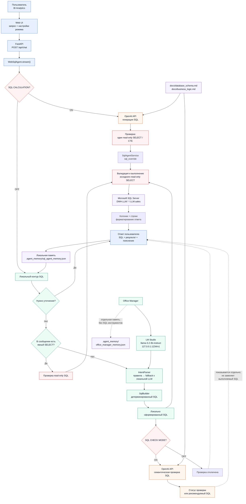

# Архитектура SQL-агента

Схема показывает фактический поток запроса в `BI Analytics`: локальную LLM в
LM Studio, два режима OpenAI API, детерминированную сборку SQL и границу доступа
к SQL Server.

## Режимы OpenAI

| SQL CALCULATION | SQL CHECK MODE | Кто формирует SQL | Что делает OpenAI | Что выполняется |
|---|---|---|---|---|
| ON | ON или OFF | OpenAI API | Генерирует read-only SQL; повторная проверка пропускается | SQL от OpenAI после локальной валидации |
| OFF | ON | Локальный контур | Проверяет смысл локального SQL и при ошибке показывает рекомендацию | Исходный локальный SQL |
| OFF | OFF | Локальный контур | Не вызывается | Исходный локальный SQL |

## Границы данных и доступа

- Локальная LLM участвует в разборе неоднозначного намерения, но стандартные
  запросы проходят через правила `IntentParser` и детерминированный `SqlBuilder`.
- OpenAI получает запрос пользователя, документацию схемы и бизнес-правил, а в
  режиме проверки — также сформированный SQL.
- OpenAI не получает инструменты SQL Server, не выполняет запрос и не видит
  строки результата.
- Подключение к SQL Server и выполнение read-only SQL остаются внутри локального
  приложения.
- При недоступном OpenAI режим `SQL CALCULATION` останавливает запрос безопасной
  ошибкой; автоматического перехода на локальную генерацию нет.

Источники реализации: `sql_agent/web.py`, `sql_agent/service.py`,
`sql_agent/intent_parser.py`, `sql_agent/sql_builder.py`,
`sql_agent/sql_reviewer.py`, `sql_agent/langchain_factory.py`.
